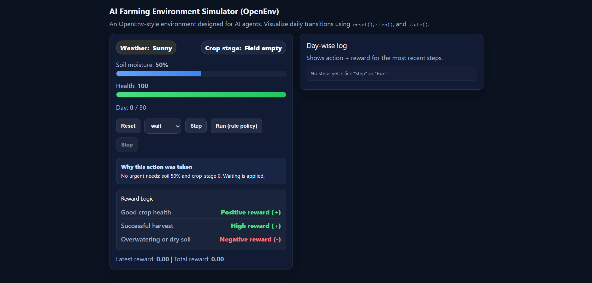

# 🌱 AI Farming Environment Simulator (OpenEnv)

## 🚀 Overview

FarmingEnv is an AI-powered farming simulation environment where an agent learns to make optimal decisions such as watering, planting, and harvesting based on changing weather and soil conditions.

This project follows an OpenEnv-style API using `step()`, `reset()`, and `state()` to simulate real-world decision-making.

---

## ❗ Problem

Farmers often struggle to make correct decisions due to unpredictable weather and changing soil conditions.

This can lead to:
- Poor crop yield  
- Resource wastage  
- Financial loss  

---

## 💡 Solution

This project implements a turn-based farming simulation environment where an AI agent learns optimal farming strategies using rewards and penalties.

The system includes:

- **Environment**: `farming_env.py`
  - Random weather (`sunny`, `rainy`, `hot`)
  - Soil moisture tracking
  - Crop growth stages
  - Health system
  - Actions: `water`, `plant`, `harvest`, `wait`

- **Tasks**: `farming_tasks.py`
  - Easy: Keep crop alive for 10 days  
  - Medium: Maintain health above 70 for 20 days  
  - Hard: Maximize harvest yield within 30 days  

- **Grader**: `farming_grader.py`
  - Converts performance into a score between 0.0 and 1.0  

- **Agent**: `run_agent.py`
  - Rule-based agent that interacts with the environment  

- **Frontend UI**: `frontend/`
  - Next.js dashboard for real-time visualization  

---

## 🖼️ Demo

   

---

## ⚙️ How It Works

1. `reset()` initializes the environment  
2. Agent selects an action (`water`, `wait`, etc.)  
3. `step(action)` updates the state and returns reward  
4. Agent learns optimal behavior over time  

---

## 🧠 Reward System

- ✅ Good crop health → Positive reward  
- 🌾 Successful harvest → High reward  
- ❌ Overwatering → Penalty  
- ❌ Dry soil → Penalty  

---

## 💻 Tech Stack

- Frontend: Next.js  
- Backend: Python  
- Simulation: Custom OpenEnv-style environment  
- Deployment: Docker  

---

## 📁 Project Structure

farming_env.py → Core environment
farming_tasks.py → Task definitions
farming_grader.py → Evaluation logic
run_agent.py → Demo agent
openenv.yaml → Environment config
frontend/ → UI dashboard    


---

## ▶️ How to Run

### Run Python Simulation

```bash
python run_agent.py  
``` 
--- 

### Run with Docker    

```bash
docker build -t farming-env .
docker run --rm farming-env     
```   

---

### Run Frontend (Next.js)     

```bash
cd frontend
npm install
npm run dev  
```

Open in browser: http://localhost:3000      

---

## 🌍 Why This Matters

This project demonstrates how AI agents can learn decision-making in dynamic real-world environments like agriculture.
It can be extended to real-world smart farming systems.    

---

## 🏁 Conclusion 

 - Built a real-world simulation environment
 - Implemented AI decision-making using rewards
 - Demonstrated OpenEnv-compatible system   

## 🙌 Author   

Priyambada Kumari


